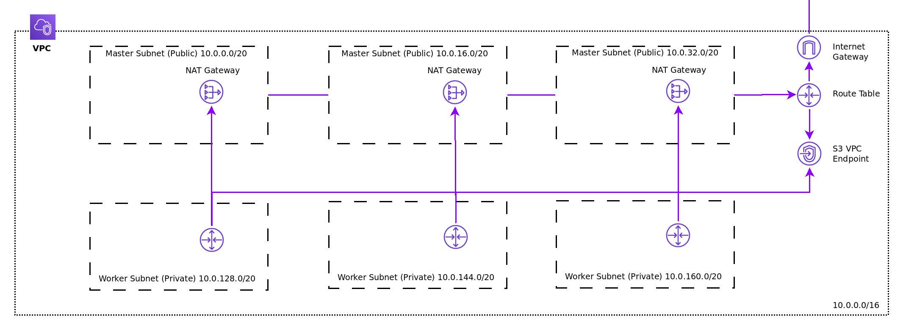

# Cluster Installation

At this point, you are ready to perform the OpenShift installation. You have two choices for installing your cluster on
AWS, Installer-Provided Infrastructure (IPI) or User-Provided Infrastructure (UPI). See below for examples of each.

## Example: Installer-Provided Infrastructure (IPI)

The steps for performing an IPI-based install are outlined [here][cloud-install]. Following this guide you may begin at
Step 3: Download the Installer.

### Create Configuration

```console
[~]$ openshift-install-linux-amd64 create install-config
? SSH Public Key /home/user_id/.ssh/id_rsa.pub
? Platform aws
? Region us-east-1
? Base Domain openshiftcorp.com
? Cluster Name test
? Pull Secret [? for help]
```

### Create Cluster

```console
[~]$ openshift-install-linux-amd64 create cluster
INFO Waiting up to 30m0s for the Kubernetes API...
INFO API v1.11.0+85a0623 up
INFO Waiting up to 30m0s for the bootstrap-complete event...
INFO Destroying the bootstrap resources...
INFO Waiting up to 10m0s for the openshift-console route to be created...
INFO Install complete!
INFO Run 'export KUBECONFIG=/home/user/auth/kubeconfig' to manage the cluster with 'oc', the OpenShift CLI.
INFO The cluster is ready when 'oc login -u kubeadmin -p XXXX' succeeds (wait a few minutes).
INFO Access the OpenShift web-console here: https://console-openshift-console.apps.test.openshiftcorp.com
INFO Login to the console with user: kubeadmin, password: XXXX
```

### Running Cluster

In Route53, there will be a new, private hosted zone (for internal lookups):


In EC2, there will be 6 running instances:


The installation creates an encrypted AMI for the bootstrap and control-plane machines.
The encrypted AMI is [copied][encrypted-copy] from the AMI configured in the control-plane machine-API provider spec, 
which is RHCOS by default. The encryption uses the default EBS key for your target account and region 
(`aws kms describe-key --key-id alias/aws/ebs`). The encrypted AMI is de-registered by `destroy cluster`.

The relationship of the EC2 instances, elastic load balancers (ELBs) and Route53 hosted zones is as depicted:


The nodes within the VPC utilize the internal DNS and use the Router and Internal API load balancers. External/Internet
access to the cluster use the Router and External API load balancers. Nodes are spread equally across 3 availability
zones.

The OpenShift console is available via the kubeadmin login provided by the installer:


## Example: User Provided Infrastructure (UPI)

The steps for performing a UPI-based install are outlined here. This example makes use of and reference to several 
CloudFormation templates located in this repository.

### Create Ignition Configs

The machines will be manually started. Therefore, it is required to generate the bootstrap and machine ignition configs 
and store them for later steps.

```console
[~]$ openshift-install-linux-amd64 create ignition-configs
? SSH Public Key /home/user_id/.ssh/id_rsa.pub
? Platform aws
? Region us-east-1
? Base Domain openshiftcorp.com
? Cluster Name test
? Pull Secret [? for help]
```

After running the command, several files will be available in the directory.

```console
[~]$ ls
auth  bootstrap.ign  master.ign  metadata.json  worker.ign
```

### Create/Identify the VPC to be Used

You may create a VPC with various desirable characteristics for your situation (VPN, route tables, etc.). The recommended
VPC configuration and a CloudFormation template is provided [here](../../../upi/aws/cloudformation/01_vpc.yaml). 

A created VPC via the template or manually should approximate a setup similar to this:



### Create DNS entries and Load Balancers for Control Plane Components

The recommended DNS and load balancer configuration within a CloudFormation template is provided 
[here](../../../upi/aws/cloudformation/02_cluster_infra.yaml). It uses a public hosted zone and creates a private hosted
zone similar to the IPI installation method. It also creates load balancers and listeners the same way as the IPI
installation method. This template can be run multiple times within a single VPC and in combination with the VPC
template provided above.

#### Create Load Balancer Configuration

It is recommended to create a TCP load balancer for ports 6443 and 22623. The targets will be the master nodes.
Port 6443 must be accessible to both clients external to the cluster and nodes within the cluster. Port 22623 must
be accessible to nodes within the cluster. 

#### Create Route53 Hosted Zones & Records

For the cluster name identified earlier in "Create Ignition Configs", you must create a DNS entry which resolves to 
your created load balancer. The entry api.$clustername.$domain should point to the load balancer.

### Create Security Groups and IAM Roles

The recommended security group and IAM configuration within a CloudFormation template is provided 
[here](../../../upi/aws/cloudformation/03_cluster_security.yaml). Run this template to get the minimal and permanent
set of security groups and IAM roles needed for an operational cluster.

TODO: Identify the manual creation requirement/steps.

### Launch Temporary Bootstrap Resource

The recommended bootstrap launch and other necessary, temporary security group plus IAM configuration and a CloudFormation 
template is provided [here](../../../upi/aws/cloudformation/04_cluster_bootstrap.yaml). Upload your generated bootstrap.ign
file to an S3 bucket in your account and run this template to get a bootstrap node along with a predictable clean up of 
the resources when complete. 

TODO: Identify the manual creation requirement/steps.

### Launch Permanent Master Nodes

The recommended master launch and other necessary DNS entries for etcd are provided within a CloudFormation 
template [here](../../../upi/aws/cloudformation/05_cluster_master_nodes.yaml). Run this template to get a three master
nodes. 

TODO: Identify the manual creation requirements/steps.

### Monitor for bootstrap-complete and initialization

TODO: Identify the UPI command and expected output in openshift-install

### Cleanup Machine API Resources

TODO: Identify deleting the pre-populated, disconnected machine entries.

### Launch Additional Worker Nodes

TODO: Call out the possible options here.

#### Option 1: Dynamic Compute using Machine API

TODO: Identify the updates necessary to the machine sets.

#### Option 2: Manually Launching Worker Instances

TODO: Identify the manual creation requirement.

### Monitor for cluster completion

TODO: Identify the UPI command and expected output in openshift-install

[cloud-install]: https://cloud.openshift.com/clusters/install
[encrypted-copy]: https://docs.aws.amazon.com/AWSEC2/latest/UserGuide/AMIEncryption.html#create-ami-encrypted-root-snapshot

